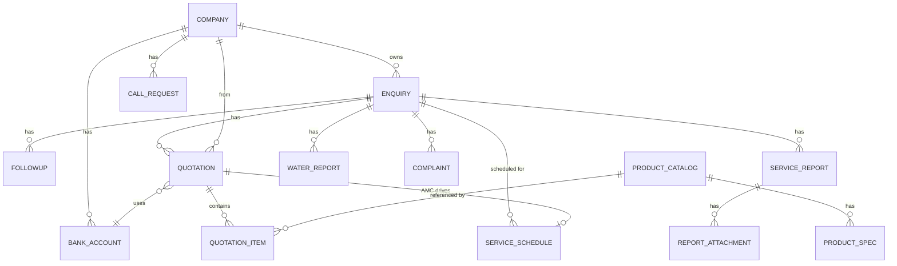
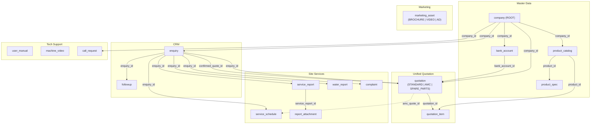

# Xpredict UI — Complete Database Schema (v3 — Final)

> **Database Name:** `xpredict_db`
> **Engine:** MySQL 8+ / PostgreSQL 15+ (SQL standard)
> **Charset:** utf8mb4 / UTF-8

---

## What Changed from v2 → v3

| Issue | Fix |
|---|---|
| `bank_account` missing `is_active` | ✅ Added `is_active` column |
| Marketing Kit, User Manuals, Machine Videos are global admin content — not dealer-specific | ✅ Removed `company_id` from `user_manual`, `machine_video`, `marketing_asset`. These are uploaded by admin and visible to ALL dealers |
| No link between `enquiry` and `company` — can't tell which dealer owns which enquiry | ✅ Added `company_id` FK to `enquiry`. Now every enquiry, quote, site belongs to a dealer |
| Service scheduling exists independently of AMC — but scheduling should derive from AMC contract | ✅ Added optional `amc_quote_id` FK to `service_schedule` |
| Installation/Tech Support module (User Manuals, Machine Videos, Request for Call) had NO tables | ✅ Added `user_manual`, `machine_video`, `call_request` tables |
| Marketing Kit (Brochures, Promo Videos, Ad Creatives) had NO tables | ✅ Added `marketing_asset` table |
| Capacity Calculator & Feasibility Checklist had no tables | ✅ Documented as client-side-only (no DB needed) |

---

## Architecture Overview



---

## MASTER DATA

### Table 1: `company` — Dealer / Your Company (ROOT ENTITY)

Everything traces back here. A company owns enquiries, bank accounts, manuals, videos, marketing assets.

| Column | Type | Constraints | Description |
|---|---|---|---|
| `id` | INT | **PK**, AUTO_INCREMENT | |
| `company_name` | VARCHAR(255) | NOT NULL | e.g. "Xpredict Automation Solutions Pvt Ltd" |
| `phone` | VARCHAR(20) | | |
| `email` | VARCHAR(255) | | |
| `gst_no` | VARCHAR(20) | | e.g. "29AAACX2581L1ZU" |
| `pan_no` | VARCHAR(15) | | |
| `address` | TEXT | | |
| `is_active` | BOOLEAN | DEFAULT TRUE | Soft delete / deactivate |
| `created_at` | TIMESTAMP | DEFAULT NOW() | |
| `updated_at` | TIMESTAMP | ON UPDATE NOW() | |

### Table 2: `bank_account`

| Column | Type | Constraints | Description |
|---|---|---|---|
| `id` | INT | **PK**, AUTO_INCREMENT | |
| `company_id` | INT | **FK → company.id**, NOT NULL | |
| `bank_name` | VARCHAR(255) | NOT NULL | |
| `account_no` | VARCHAR(30) | NOT NULL | |
| `ifsc_code` | VARCHAR(15) | NOT NULL | |
| `is_default` | BOOLEAN | DEFAULT FALSE | Default bank for new quotes |
| `is_active` | BOOLEAN | DEFAULT TRUE | ✅ **Added** — deactivate without deleting |
| `created_at` | TIMESTAMP | DEFAULT NOW() | |

---

## CRM

### Table 3: `enquiry` ⭐ CENTRAL ENTITY

| Column | Type | Constraints | Description |
|---|---|---|---|
| `id` | INT | **PK**, AUTO_INCREMENT | |
| `company_id` | INT | **FK → company.id**, NOT NULL | ✅ **Added** — which dealer/company this enquiry belongs to |
| `customer_name` | VARCHAR(255) | NOT NULL | |
| `contact_person` | VARCHAR(255) | | |
| `address` | TEXT | | |
| `pincode` | VARCHAR(10) | | Zone filtering |
| `phone` | VARCHAR(20) | | |
| `remarks` | TEXT | | |
| `status` | ENUM('PENDING','CONFIRMED','LOST') | DEFAULT 'PENDING' | |
| `confirmed_quote_id` | INT | FK → quotation.id, NULLABLE | |
| `oc_number` | VARCHAR(30) | UNIQUE, NULLABLE | e.g. "STP/OC/26-27/001" |
| `created_at` | TIMESTAMP | DEFAULT NOW() | |
| `updated_at` | TIMESTAMP | ON UPDATE NOW() | |

> **Now traceable:** `company` → `enquiry` → `quotation` → everything else. A dealer can see ONLY their own enquiries, sites, quotes, orders.

### Table 4: `followup`

| Column | Type | Constraints | Description |
|---|---|---|---|
| `id` | INT | **PK**, AUTO_INCREMENT | |
| `enquiry_id` | INT | **FK → enquiry.id**, ON DELETE CASCADE | |
| `remarks` | TEXT | NOT NULL | |
| `next_followup_date` | DATE | NOT NULL | |
| `entered_date` | DATE | NOT NULL | |
| `created_at` | TIMESTAMP | DEFAULT NOW() | |

---

## UNIFIED PRODUCT & QUOTATION SYSTEM

### Table 5: `product_catalog` ⭐ UNIFIED

| Column | Type | Constraints | Description |
|---|---|---|---|
| `id` | INT | **PK**, AUTO_INCREMENT | |
| `company_id` | INT | **FK → company.id**, NOT NULL | Products belong to a dealer |
| `category` | ENUM('EQUIPMENT','AMC_SERVICE','SPARE_PART') | NOT NULL | |
| `sub_category` | VARCHAR(50) | NULLABLE | "Pumps", "Valves", "RO Plant", etc. |
| `name` | VARCHAR(255) | NOT NULL | |
| `description` | VARCHAR(500) | | |
| `hsn_code` | VARCHAR(20) | | |
| `base_price` | DECIMAL(12,2) | NOT NULL | |
| `margin_percent` | DECIMAL(5,2) | DEFAULT 0 | |
| `gst_rate` | DECIMAL(5,2) | DEFAULT 18 | |
| `stock` | INT | DEFAULT 0 | Only for SPARE_PART |
| `image_url` | VARCHAR(500) | | Only for SPARE_PART |
| `is_active` | BOOLEAN | DEFAULT TRUE | |
| `created_at` | TIMESTAMP | DEFAULT NOW() | |
| `updated_at` | TIMESTAMP | ON UPDATE NOW() | |

### Table 6: `product_spec`

| Column | Type | Constraints | Description |
|---|---|---|---|
| `id` | INT | **PK**, AUTO_INCREMENT | |
| `product_id` | INT | **FK → product_catalog.id**, ON DELETE CASCADE | |
| `spec_text` | VARCHAR(255) | NOT NULL | |
| `sort_order` | INT | DEFAULT 0 | |

### Table 7: `quotation` ⭐ UNIFIED

| Column | Type | Constraints | Description |
|---|---|---|---|
| `id` | INT | **PK**, AUTO_INCREMENT | |
| `enquiry_id` | INT | **FK → enquiry.id**, ON DELETE CASCADE | |
| `quote_type` | ENUM('STANDARD','AMC','SPARE_PARTS') | NOT NULL | |
| `title` | VARCHAR(255) | | |
| `quote_no` | VARCHAR(50) | UNIQUE, NOT NULL | |
| `amount` | DECIMAL(12,2) | NOT NULL | Grand total |
| `date` | DATE | NOT NULL | |
| `status` | ENUM('DRAFT','QUOTE_SENT','CONFIRMED','REJECTED','EXPIRED') | DEFAULT 'DRAFT' | |
| `company_id` | INT | FK → company.id | "From" details |
| `to_customer_name` | VARCHAR(255) | | |
| `to_contact_person` | VARCHAR(255) | | |
| `to_phone` | VARCHAR(20) | | |
| `to_address` | TEXT | | |
| `to_gst` | VARCHAR(20) | | |
| `to_pan` | VARCHAR(15) | | |
| `to_state` | VARCHAR(50) | | |
| `bank_account_id` | INT | FK → bank_account.id | |
| `terms` | TEXT | | |
| `amc_type` | ENUM('Comprehensive','Non Comprehensive') | NULLABLE | AMC only |
| `amc_interval_days` | INT | NULLABLE | AMC only: 30/60/90/180/365 |
| `amc_is_active` | BOOLEAN | DEFAULT FALSE | AMC only |
| `created_at` | TIMESTAMP | DEFAULT NOW() | |
| `updated_at` | TIMESTAMP | ON UPDATE NOW() | |

### Table 8: `quotation_item`

| Column | Type | Constraints | Description |
|---|---|---|---|
| `id` | INT | **PK**, AUTO_INCREMENT | |
| `quotation_id` | INT | **FK → quotation.id**, ON DELETE CASCADE | |
| `product_id` | INT | FK → product_catalog.id, NULLABLE | |
| `description` | VARCHAR(500) | NOT NULL | Snapshot |
| `hsn_code` | VARCHAR(20) | | Snapshot |
| `base_price` | DECIMAL(12,2) | NOT NULL | |
| `margin_percent` | DECIMAL(5,2) | DEFAULT 0 | |
| `gst_rate` | DECIMAL(5,2) | DEFAULT 18 | |
| `quantity` | INT | DEFAULT 1 | |
| `taxable_amount` | DECIMAL(12,2) | GENERATED | |
| `gst_amount` | DECIMAL(12,2) | GENERATED | |
| `total_amount` | DECIMAL(12,2) | GENERATED | |
| `sort_order` | INT | DEFAULT 0 | |

---

## SITE SERVICES

### Table 9: `service_schedule`

| Column | Type | Constraints | Description |
|---|---|---|---|
| `id` | INT | **PK**, AUTO_INCREMENT | |
| `enquiry_id` | INT | **FK → enquiry.id**, ON DELETE CASCADE | The deployed site |
| `amc_quote_id` | INT | **FK → quotation.id**, NULLABLE | ✅ **Added** — which AMC contract this schedule is based on |
| `dc_number` | VARCHAR(30) | | e.g. "DC/STP/26-27/045" |
| `service_type` | VARCHAR(100) | | e.g. "Routine Preventive Maintenance (PMS)" |
| `service_interval_days` | INT | DEFAULT 30 | 15/30/60/90/180 |
| `last_serviced_date` | DATE | NULLABLE | |
| `next_service_date` | DATE | GENERATED/STORED | `last_serviced_date + interval` |
| `technician` | VARCHAR(255) | | |
| `zone_pincode` | VARCHAR(10) | | |
| `notes` | TEXT | | |
| `created_at` | TIMESTAMP | DEFAULT NOW() | |
| `updated_at` | TIMESTAMP | ON UPDATE NOW() | |

> **AMC → Schedule link:** When an AMC is confirmed, the service schedule for that site can be created/updated automatically using the AMC's `amc_interval_days`. The `amc_quote_id` traces which contract drives the schedule.

### Table 10: `service_report`

| Column | Type | Constraints | Description |
|---|---|---|---|
| `id` | INT | **PK**, AUTO_INCREMENT | |
| `enquiry_id` | INT | **FK → enquiry.id**, ON DELETE CASCADE | |
| `report_code` | VARCHAR(20) | UNIQUE, NOT NULL | e.g. "SR-12345" |
| `date` | DATE | NOT NULL | Auto-captured |
| `technician` | VARCHAR(255) | NOT NULL | |
| `zone` | VARCHAR(100) | NOT NULL | |
| `zone_pincode` | VARCHAR(10) | | |
| `remarks` | TEXT | NOT NULL | |
| `service_person_name` | VARCHAR(255) | NOT NULL | |
| `service_person_signature` | LONGTEXT | | Base64 |
| `client_name` | VARCHAR(255) | | |
| `client_signature` | LONGTEXT | NULLABLE | Base64 |
| `client_signed_at` | VARCHAR(100) | NULLABLE | |
| `status` | ENUM('AWAITING_CLIENT_SIGN','COMPLETED') | DEFAULT 'AWAITING_CLIENT_SIGN' | |
| `uploaded_at` | VARCHAR(100) | | |
| `last_modified_at` | VARCHAR(100) | | |
| `created_at` | TIMESTAMP | DEFAULT NOW() | |
| `updated_at` | TIMESTAMP | ON UPDATE NOW() | |

### Table 11: `report_attachment`

| Column | Type | Constraints | Description |
|---|---|---|---|
| `id` | INT | **PK**, AUTO_INCREMENT | |
| `service_report_id` | INT | **FK → service_report.id**, ON DELETE CASCADE | |
| `file_name` | VARCHAR(255) | NOT NULL | |
| `file_size` | VARCHAR(20) | | |
| `file_type` | ENUM('IMAGE','DOC') | NOT NULL | |
| `file_path` | VARCHAR(500) | | Storage path |
| `sort_order` | INT | DEFAULT 0 | |
| `created_at` | TIMESTAMP | DEFAULT NOW() | |

### Table 12: `water_report`

| Column | Type | Constraints | Description |
|---|---|---|---|
| `id` | INT | **PK**, AUTO_INCREMENT | |
| `enquiry_id` | INT | **FK → enquiry.id**, ON DELETE CASCADE | |
| `date_tested` | DATE | NOT NULL | |
| `ph_level` | VARCHAR(10) | NOT NULL | |
| `tds_ppm` | VARCHAR(10) | NOT NULL | |
| `hardness` | VARCHAR(20) | NOT NULL | |
| `attachment_name` | VARCHAR(255) | NULLABLE | |
| `attachment_path` | VARCHAR(500) | NULLABLE | |
| `created_at` | TIMESTAMP | DEFAULT NOW() | |

### Table 13: `complaint`

| Column | Type | Constraints | Description |
|---|---|---|---|
| `id` | INT | **PK**, AUTO_INCREMENT | |
| `enquiry_id` | INT | **FK → enquiry.id**, ON DELETE CASCADE | |
| `ticket_id` | VARCHAR(20) | UNIQUE, NOT NULL | e.g. "TKT-8291" |
| `date` | DATE | NOT NULL | |
| `service_person_name` | VARCHAR(255) | NOT NULL | |
| `issue` | TEXT | NOT NULL | |
| `status` | ENUM('OPEN','RESOLVED') | DEFAULT 'OPEN' | |
| `resolved_at` | TIMESTAMP | NULLABLE | |
| `created_at` | TIMESTAMP | DEFAULT NOW() | |
| `updated_at` | TIMESTAMP | ON UPDATE NOW() | |

---

## INSTALLATION & TECH SUPPORT (NEW)

### Table 14: `user_manual`

Stores uploaded user manuals / handbooks for equipment. **Admin-uploaded, visible to ALL dealers.**

| Column | Type | Constraints | Description |
|---|---|---|---|
| `id` | INT | **PK**, AUTO_INCREMENT | |
| `title` | VARCHAR(255) | NOT NULL | e.g. "RO Plant 1000 LPH User Guide" |
| `category` | VARCHAR(50) | NOT NULL | "RO Plants", "Water Softeners", "UV Systems", "Automation / PLC", "Chemical Dosing" |
| `file_name` | VARCHAR(255) | NOT NULL | Original PDF filename |
| `file_path` | VARCHAR(500) | | Storage path (S3/local) |
| `content_preview` | TEXT | | Summary / description text |
| `uploaded_date` | DATE | NOT NULL | |
| `is_active` | BOOLEAN | DEFAULT TRUE | |
| `created_at` | TIMESTAMP | DEFAULT NOW() | |

### Table 15: `machine_video`

Stores machine operation / troubleshooting / installation videos. **Admin-uploaded, visible to ALL dealers.**

| Column | Type | Constraints | Description |
|---|---|---|---|
| `id` | INT | **PK**, AUTO_INCREMENT | |
| `title` | VARCHAR(255) | NOT NULL | e.g. "Complete Unboxing & Setup: 1000 LPH RO" |
| `category` | VARCHAR(50) | NOT NULL | "Installation", "Operations", "Troubleshooting", "Maintenance", "Automation" |
| `description` | TEXT | | |
| `source_link` | VARCHAR(500) | | YouTube embed URL or external link |
| `video_file_name` | VARCHAR(255) | | Uploaded video filename |
| `video_file_path` | VARCHAR(500) | | Storage path |
| `uploaded_date` | DATE | NOT NULL | |
| `is_active` | BOOLEAN | DEFAULT TRUE | |
| `created_at` | TIMESTAMP | DEFAULT NOW() | |

### Table 16: `call_request`

"Request for Call" — field engineers or dealers requesting technical callback.

| Column | Type | Constraints | Description |
|---|---|---|---|
| `id` | INT | **PK**, AUTO_INCREMENT | |
| `company_id` | INT | **FK → company.id**, NOT NULL | |
| `request_id` | VARCHAR(20) | UNIQUE, NOT NULL | e.g. "RFC-101" |
| `customer_name` | VARCHAR(255) | NOT NULL | Selected from DMS/enquiries |
| `contact_name` | VARCHAR(255) | NOT NULL | Contact person name |
| `contact_number` | VARCHAR(20) | NOT NULL | Phone number |
| `query` | TEXT | NOT NULL | Technical question / issue |
| `status` | ENUM('Pending','Resolved') | DEFAULT 'Pending' | |
| `resolved_at` | TIMESTAMP | NULLABLE | |
| `created_at` | TIMESTAMP | DEFAULT NOW() | |
| `updated_at` | TIMESTAMP | ON UPDATE NOW() | |

---

## MARKETING KIT (NEW)

### Table 17: `marketing_asset`

Unified table for brochures, promo videos, and ad creatives. **Admin-uploaded, visible to ALL dealers.**

| Column | Type | Constraints | Description |
|---|---|---|---|
| `id` | INT | **PK**, AUTO_INCREMENT | |
| `asset_type` | ENUM('BROCHURE','VIDEO','AD_CREATIVE') | NOT NULL | What kind of asset |
| `title` | VARCHAR(255) | NOT NULL | e.g. "Master Product Catalog 2026-27" |
| `description` | TEXT | | |
| `category` | VARCHAR(100) | | For brochures: "Master Catalog", "Product Brochure", "Automation Kit". For videos: type |
| `file_name` | VARCHAR(255) | | Original filename |
| `file_path` | VARCHAR(500) | | Storage path |
| `file_size` | VARCHAR(20) | | e.g. "8.4 MB" |
| `source_link` | VARCHAR(500) | | YouTube/external link (for videos) |
| `duration` | VARCHAR(20) | | For videos: "03:15 min" |
| `resolution` | VARCHAR(50) | | For videos: "4K Ultra HD", "1080p Full HD" |
| `format` | VARCHAR(100) | | For ads: "Instagram Square (1080x1080)", "A4 Leaflet" |
| `is_active` | BOOLEAN | DEFAULT TRUE | |
| `created_at` | TIMESTAMP | DEFAULT NOW() | |

---

## TOOLS MODULE (NO DB TABLES NEEDED)

### Capacity Calculator
> **Client-side only.** Pure input → calculation → display. No data is saved.
> User enters: Application Type (Hospital/Apartment/Industry), Number of Occupants, Water Usage per person (L/day), Operating Hours.
> Calculates: Daily water requirement (KLD), wastewater generation, recommended STP/ETP size, flow rate (LPH).
> Configuration presets (LPCD, wastewater %) are currently hardcoded. If needed in future, create a `calculator_config` table.

### Feasibility Checklist
> **Client-side only.** A toggle checklist with 5 items:
> Raw Water Lab Test, 3-Phase Power Supply, Gravity Drain, Floor Clearance, Storage Tank.
> Currently stateless (resets on page load). If persistence is needed, it can be stored as a JSON column on the `enquiry` or `service_schedule` table.

---

## COMPLETE ENTITY RELATIONSHIP



---

## ALL FOREIGN KEYS

| Parent | Child | FK Column | Cascade | Notes |
|---|---|---|---|---|
| `company` | `bank_account` | `company_id` | CASCADE | |
| `company` | `enquiry` | `company_id` | RESTRICT | ✅ NEW |
| `company` | `product_catalog` | `company_id` | RESTRICT | |
| `company` | `quotation` | `company_id` | RESTRICT | |
| `company` | `call_request` | `company_id` | CASCADE | ✅ NEW |
| `bank_account` | `quotation` | `bank_account_id` | SET NULL | |
| `enquiry` | `followup` | `enquiry_id` | CASCADE | |
| `enquiry` | `quotation` | `enquiry_id` | CASCADE | |
| `quotation` | `enquiry` | `confirmed_quote_id` | SET NULL | |
| `quotation` | `quotation_item` | `quotation_id` | CASCADE | |
| `quotation` | `service_schedule` | `amc_quote_id` | SET NULL | ✅ NEW |
| `product_catalog` | `quotation_item` | `product_id` | SET NULL | |
| `product_catalog` | `product_spec` | `product_id` | CASCADE | |
| `enquiry` | `service_schedule` | `enquiry_id` | CASCADE | |
| `enquiry` | `service_report` | `enquiry_id` | CASCADE | |
| `service_report` | `report_attachment` | `service_report_id` | CASCADE | |
| `enquiry` | `water_report` | `enquiry_id` | CASCADE | |
| `enquiry` | `complaint` | `enquiry_id` | CASCADE | |

---

## Reference Number Formats

| Entity | Format | Example |
|---|---|---|
| OC Number | `STP/OC/YY-YY/NNN` | `STP/OC/26-27/001` |
| Standard Quote | `XAS/YY-YY/NNNN` | `XAS/26-27/1001` |
| AMC Quote | `AMC/YY-YY/NNNN` | `AMC/26-27/1234` |
| Spare Parts Order | `ORD-NNNN` | `ORD-1234` |
| DC Number | Manual entry | `DC/STP/26-27/045` |
| Service Report | `SR-NNNNN` | `SR-12345` |
| Complaint Ticket | `TKT-NNNN` | `TKT-8291` |
| Call Request | `RFC-NNN` | `RFC-101` |

---

## Suggested Indexes

```sql
-- Company
CREATE INDEX idx_company_active ON company(is_active);

-- Bank
CREATE INDEX idx_bank_company ON bank_account(company_id, is_active);

-- Enquiry (CRITICAL)
CREATE INDEX idx_enquiry_company ON enquiry(company_id);
CREATE INDEX idx_enquiry_status ON enquiry(status);
CREATE INDEX idx_enquiry_company_status ON enquiry(company_id, status);
CREATE INDEX idx_enquiry_pincode ON enquiry(pincode);
CREATE UNIQUE INDEX idx_enquiry_oc ON enquiry(oc_number);

-- Quotation
CREATE INDEX idx_quotation_enquiry_type ON quotation(enquiry_id, quote_type);
CREATE INDEX idx_quotation_status ON quotation(status);
CREATE UNIQUE INDEX idx_quotation_quote_no ON quotation(quote_no);
CREATE INDEX idx_quotation_amc_active ON quotation(enquiry_id, amc_is_active);

-- Followup
CREATE INDEX idx_followup_enquiry ON followup(enquiry_id);
CREATE INDEX idx_followup_date ON followup(next_followup_date);

-- Product
CREATE INDEX idx_product_company_cat ON product_catalog(company_id, category, is_active);

-- Service
CREATE INDEX idx_schedule_enquiry ON service_schedule(enquiry_id);
CREATE INDEX idx_schedule_amc ON service_schedule(amc_quote_id);
CREATE INDEX idx_report_enquiry ON service_report(enquiry_id);
CREATE INDEX idx_report_status ON service_report(status);
CREATE INDEX idx_complaint_enquiry ON complaint(enquiry_id);
CREATE INDEX idx_complaint_status ON complaint(status);
CREATE INDEX idx_water_enquiry ON water_report(enquiry_id);

-- Tech Support (global, no company filter)
CREATE INDEX idx_manual_category ON user_manual(category, is_active);
CREATE INDEX idx_video_category ON machine_video(category, is_active);
CREATE INDEX idx_call_company ON call_request(company_id, status);

-- Marketing (global, no company filter)
CREATE INDEX idx_marketing_type ON marketing_asset(asset_type, is_active);
```

---

## Total Tables: 17

| # | Table | Module | Purpose |
|---|---|---|---|
| 1 | `company` | Master | ROOT entity — dealer/company |
| 2 | `bank_account` | Master | Bank details (with `is_active`) |
| 3 | `enquiry` | CRM | Customer lead → deployed site (with `company_id`) |
| 4 | `followup` | CRM | Follow-up history |
| 5 | `product_catalog` | Unified | All products (EQUIPMENT / AMC_SERVICE / SPARE_PART) |
| 6 | `product_spec` | Unified | Product specifications |
| 7 | `quotation` | Unified | All quotes (STANDARD / AMC / SPARE_PARTS) |
| 8 | `quotation_item` | Unified | Line items for any quotation |
| 9 | `service_schedule` | Site Services | Scheduled service (with `amc_quote_id`) |
| 10 | `service_report` | Site Services | Service visit reports |
| 11 | `report_attachment` | Site Services | Files on reports |
| 12 | `water_report` | Site Services | Water quality data |
| 13 | `complaint` | Site Services | Complaint tickets |
| 14 | `user_manual` | Tech Support | Equipment user manuals |
| 15 | `machine_video` | Tech Support | Operation/troubleshooting videos |
| 16 | `call_request` | Tech Support | Request for technical callback |
| 17 | `marketing_asset` | Marketing | Brochures, promo videos, ad creatives |

---

## Data Ownership Chain

```
COMPANY (dealer)
 ├── bank_account (is_active)
 ├── product_catalog (EQUIPMENT | AMC_SERVICE | SPARE_PART)
 │    └── product_spec
 ├── call_request
 │
 └── ENQUIRY (customer lead → deployed site)
      ├── followup
      ├── QUOTATION (STANDARD | AMC | SPARE_PARTS)
      │    ├── quotation_item
      │    └── ──→ service_schedule (if AMC confirmed)
      ├── service_schedule
      ├── service_report
      │    └── report_attachment
      ├── water_report
      └── complaint
```

GLOBAL (admin-uploaded, visible to ALL dealers):
 ├── user_manual
 ├── machine_video
 └── marketing_asset (BROCHURE | VIDEO | AD_CREATIVE)
```

> Dealer-specific data is scoped by `company_id`. Global content (manuals, videos, marketing) is accessible to everyone.
